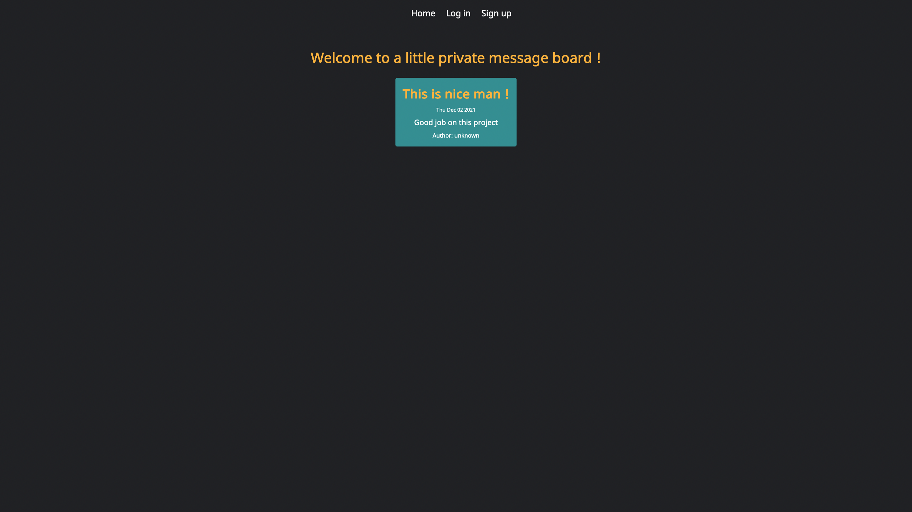

# Members-only project

## Made with Express, PassportJS and MongoDB

With this little Express app I practiced using PassportJS for logging in users and bcryptjs for encrypting new user's password's.
Message's author are hidden untill you enter a super secret password to become a member, and you can delete messages if you become an admin by, you guessed it, entering a password.

Member password: getrickrolled
Admin password: superduperpassword

<a href='https://protected-woodland-10611.herokuapp.com/'>Live preview</a>

